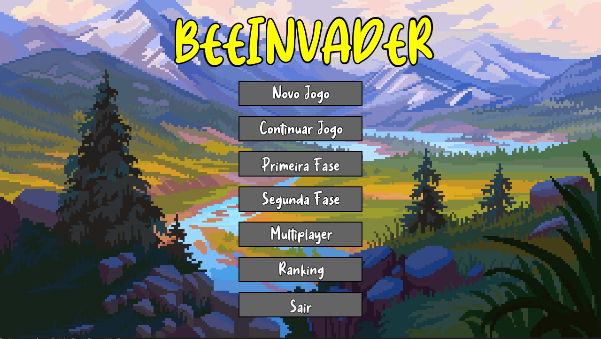
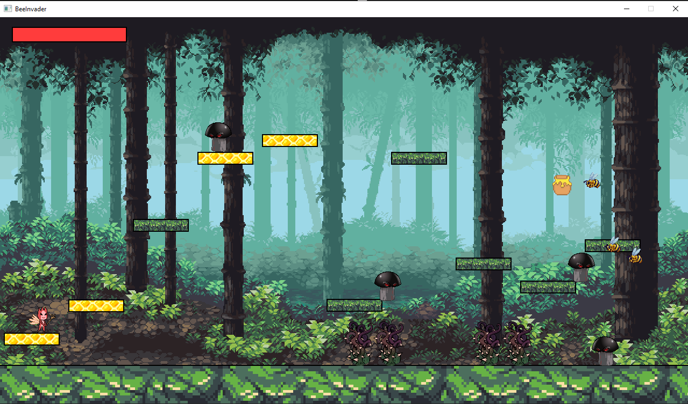
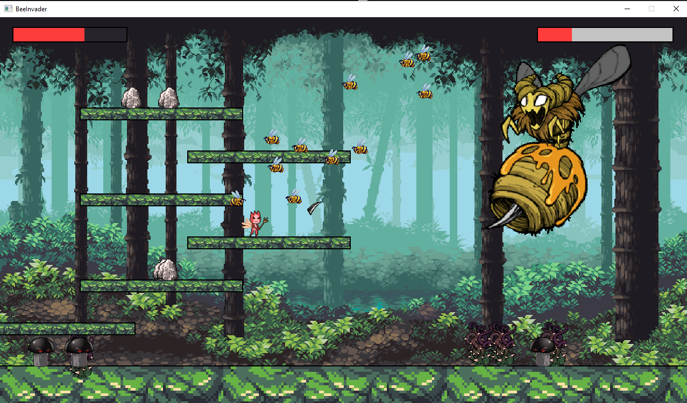

# BeeInvader

The subject of programming techniques requires a software in the format of a platform game for the
composition of the second partial note, using a practical project to stimulate the learning of software engineering
techniques, particularly of C++ object oriented programming. The game developed was the “BeeInvader”, in
which a player fights enemies and tries to survive to reach his objective. The game has two levels, in the first it is
necessary to collect a certain amount of honey pots, and in the second one it is necessary to defeat the boss. For the
development of the game, it was considered the proposed requirements and the modelling elaboration via Class
Diagram in Unified Modeling Language - UML, using as base a generic previous proposed diagram. Successively,
in C++ programming language, the software was developed with the assistance of the graphic library Simple and
Fast Multimedia Library - SFML, and modelled according to the principles of object oriented programming,
looking, mainly, for the cohesion and decoupling, as well demonstrated in class. Overall, the development of the
given software allowed the accomplishment of the intended learning objective.

# BeeInvader's Main Menu

# First Phase

# Second and final Phase

